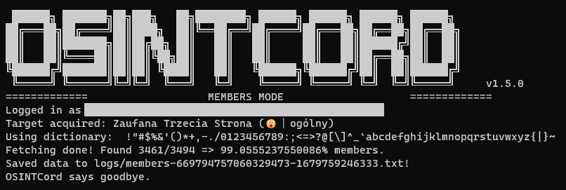

Just get data of (nearly) all of Discord guild members. Or track deleted and edited messages. Or why not both?

## Warning:

This app uses [fork of discord.js-selfbot-v13](https://github.com/MrBoombastic/discord.js-selfbot-v13).

"I don't take any responsibility for blocked Discord accounts that used this module.
Using this on a user account is prohibited by the Discord TOS and can lead to the account block."

## Usage:

- By using binaries:
  - Download binary from the [Releases](https://github.com/MrBoombastic/OSINTCord/releases) tab.
  - Fill in the `.env` file.
  - Run the binary.
- By using source code:
  - Clone this repository.
  - Make sure that you have Node.JS v18 installed.
  - Install dependencies by using `yarn`.
  - Fill in the `.env` file and place it in `src` directory.
  - Run `npm start`.

All results will be stored in the `logs` and `media` directories.

## Options:

You can use some default options from the already provided [.env](.env) file.

- When you want to dump guild members, set `MODE` to `MEMBERS` and set
  - `GUILD_ID`: The guild ID you want to get data from.
  - `CHANNEL_ID`: The channel ID, which also will be used to get data from.
  - `SPACING`: Spacing between columns in output file.
  - `TOKEN`: Your Discord account token.
  - `DELAY`: Delay between *some* requests.
  - `DICTIONARY`: Characters used by the bruteforce method. Case-insensitive, duplicates are ignored, sorted
    alphabetically.
  - `DATE_FORMAT`: format of the parsed date (refer to
    the [Day.js manual](https://day.js.org/docs/en/display/format)).
  - `DATE_LOCALE`: locale used in the parsed
    date ([list of supported locales](https://github.com/iamkun/dayjs/tree/dev/src/locale)).
- When you want to trace deleted and edited messages, set `MODE` to `WATCHDOG` and set
  - `GUILD_ID`: The guild ID you want to get data from. Set to `all`, if you want to receive data from all available
    guilds.
  - `TOKEN`: Your Discord account token.

## FAQ:

- Q: I'm getting `GUILD_MEMBERS_TIMEOUT` errors. Help! A: Increase `delay` time in config.

## Worth reading:

- https://github.com/aiko-chan-ai/discord.js-selfbot-v13/blob/main/Document/FetchGuildMember.md
